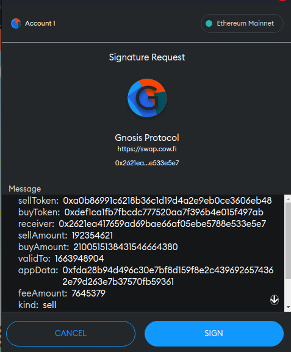

# EIP712签名

- 示例代码:
    - [📜 合约](./MintVouchers.sol)
    - [🌐 前端](https://codesandbox.io/s/compassionate-dust-jgeydc?file=/src/App.vue)
    - [🐞 测试](../../test/MintVouchers.t.sol)

[EIP712标准](https://eips.ethereum.org/EIPS/eip-712)定义了一种令用户可以用其私钥对任何人类可理解的JSON格式的信息进行电子签名。在小狐狸钱包里，会弹出一个窗口并且列出这个信息的各项内容供用户在确认签名之前阅读：



这个签名行为被视为用户在链下确认过被签署的信息内容。数字签名可以在链下被分享，并且以后被（其他角色）用在链上来执行某交易，此交易被认为已被签过名的用户钱包授权。

## 案例分析: 投票

我们通过一个简易的治理协议来展示一下分布式应用及其后端合约是如何工作的。这个协议允许人们针对某项提议通过其 `proposalId` 来发送链上投票。为了简化，这个协议允许任何人针对任何提议投票，并且只对赞成票来计数。

首先我们来看一个完全在链上执行的合约版本，然后不断改进它。这一版本带有一个 `voteFor()` 函数，任何投票者都需要直接调用这个函数来进行投票操作。

```solidity
mapping (uint256 => mapping (address => bool)) public hasVotedForProposalId;
mapping (uint256 => uint256) public yesVotesForProposalId;

...

function voteFor(uint256 proposalId) external {
    // 确保此人之前没有对这项提议投过票。
    require(!hasVotedForProposalId[proposalId][msg.sender], 'already voted');
    hasVotedForProposalId[proposalId][msg.sender] = true;
    // 增加这项提议的赞成数。
    ++yesVotesForProposalId[proposalId];
}
```

利用EIP712标准，就可以让用户无需花费gas来投票。投票者对一条链下的投票消息进行签名，这个消息表达了其想要对某项提议投赞成票的意愿。随后另外一角色可以通过调用 `voteForBySignatures()` 函数来将所有的投票签名进行归集并且一次性地计数到链上。这个函数接受的输入值为列表类型的投票者们地址，其所投的提议号，还有电子签名的各项组成部分。函数会针对每一个投票输入执行如下步骤：

1. 确保此人此前并未对此提议投过票。
2. 计算对这条投票消息的EIP712型哈希值。
3. 利用内置的 `ecrecover()` 预编译函数，通过提供的电子签名各项以及此投票消息的哈希值来计算得到签名者的地址，并校验此地址与提供的投票者地址是否一致来确认投票有效性。若投票者在应用前端所看到的投票信息与真实信息有任何不同（导致哈希值变化）或者传输过程中数字签名的任意项被篡改，那么这个计算都不会得到与已知一致的地址，验证失败，投票无效。
4. 若验证通过，则链上增加相应提议的赞成数。

```solidity
function voteForBySignatures(
    address[] calldata voters,
    uint256[] calldata proposalIds,
    uint8[] calldata vs,
    bytes32[] calldata rs,
    bytes32[] calldata ss
)
    external
{
    for (uint256 i = 0; i < voters.length; ++i) {
        uint256 proposalId = proposalIds[i];
        address voter = voters[i];
        require(!hasVotedForProposalId[proposalId][voter], 'already voted');
        hasVotedForProposalId[proposalId][voter] = true;
        require(voter == ecrecover(_getVoteHash(proposalId), vs[i], rs[i], ss[i]), 'bad signature');
        ++yesVotesForProposalId[proposalId];
    }
}
```

### EIP72型哈希

像小狐狸这样的钱包应用会接受消息的各项内容，计算其哈希并且用当前地址的私钥对这个哈希值进行签名。这里的哈希计算有其特定的方式，是根据[EIP712的要求](https://eips.ethereum.org/EIPS/eip-712#specification)来确保来自于不同协议的消息一定不会产生哈希碰撞。在这里我们用之前调用过的 `_getVoteHash()` 函数来在链上重新计算消息的哈希值。

```solidity
function _getVoteHash(uint256 proposalId) private view returns (bytes32 hash) {
    // 计算此协议所在域的哈希，应具有唯一性来指向此已部署的协议.
    bytes32 domainHash = keccak256(abi.encode(
        keccak256('EIP712Domain(string name,string version,uint256 chainId,address verifyingContract)'),
        // 协议的名字
        keccak256('ExampleVotingContract'),
        // 协议版本
        keccak256('1.0.0'),
        // 协议所在的链号
        block.chainid,
        // 此协议被部署的标准地址
        address(this)
    ));
    // 此消息类型相关的哈希值
    bytes32 structHash = keccak256(abi.encode(
        keccak256('Vote(uint256 proposalId)'),
        proposalId
    ));
    return keccak256(abi.encodePacked('\x19\x01', domainHash, structHash));
}
```

 `domainHash` 和消息类型的哈希值是不会更改的，所以你可以（并应当）用常量来存放它们。

### 从用户处获取投票签名

在前端，我们的应用会请求已链接的钱包应用生成一个对投票消息的电子签名。可以使用`ethers`库里的[`Signer._signTypedData()`](https://docs.ethers.io/v5/single-page/#/v5/api/signer/-%23-Signer-signTypedData)方式对一个钱包建立的“Signer”实例发起这样的请求。需要传入的变量是：

1. 域对象，其各项内容要与 `_getVoteHash()` 中所使用的相一致。
2. 消息里包含的各项EIP712定义类型的键值表示，最后一项应是我们的根消息类型，要与 `_getVoteHash()` 中所使用的相一致。
3. 一个对象来提供消息中的各项所需值。在我们的例子中的消息仅需要一项， `proposalId`。

```js
// 小狐狸钱包已连接。
const {v, r, s} = ethers.utils.splitSignature(
    await provider.getSigner()._signTypedData(
        // 域
        {
            name: 'ExampleVotingContract',
            version: '1.0.0',
            chainId: 1, // 以太坊L1主网
            verifyingContract: DEPLOYED_VOTING_CONTRACT_ADDRESS,
        },
        // 型
        [ { Vote: [ { name: 'proposalId', type: 'uint256' } ] } ],
        // 消息
        { proposalId: YOUR_PROPOSAL_ID },
    ),
);
```

这样则会弹出一个窗口请求用户对消息 `proposalId: YOUR_PROPOSAL_ID` 进行签名，并且以串联16进制字符串的形式返回电子签名的各项内容。我们使用 `splitSignature()` 来解构这个字符串为 `v`， `r`， 和 `s` 三项内容供 `voteForBySignatures()`使用。

## 优缺点

#### 优点: 不花gas的前端交互
想象一下你仅需对一个链下消息进行签名来授权你对某种链上行为和其触发条件的同意。这个授权平时被存在链下，直至链上行为的触发条件已达成，这个授权会被他人用来传递给协议来执行你之前已同意的行为并无需你本人再次来操作什么。因为执行交易是别人发起的，所以你不用花钱儿付gas。

#### 优点: Often costs users less gas overall
This pattern often goes hand-in-hand with [off-chain storage](./off-chain-storage), because all the fields in a message get condensed down into a single hash. Yet another bonus with signed messages is there is usually no need to even commit any data on-chain until the message is consumed. The message is considered trustworthy due to it being signed.

#### PRO: Can batch actions from different users together
Whoever executes the message can also batch it with other messages, performing all their actions in a single transaction.

#### PRO: Off-chain scaling
With off-chain messages, coordination and aggregation can be done off-chain and can leverage web2 hooks and data. Only the final settlement needs to happen on-chain.

#### CON: Censorship risk
Because signing a message doesn't mine a transaction, there is no on-chain record of it. The signature is typically shared between through traditional web2 channels, and often with a centralized component (a backend DB, for example). While no entity can forge a message signature on behalf of a user, they can choose not to share it with others. This creates a very real censorship risk.

#### CON: Cancellations
Once a message is signed, it cannot be un-signed. The only way to truly cancel a message is to do something on-chain. Typically protocols with cancel functions will simply mark the message hash as consumed/cancelled to prevent consuming it later. Another mitigation technique is to include an expiration field in the message, which is verified on-chain when consuming the message. It's cheaper to let short-lived messages expire and sign a new replacement than to a sign long-lived message and mine a cancellation transaction.

#### CON: Allowances/Custody
When working with assets from outside of a protocol, users typically either need to deposit or grant an allowance to the protocol. The signer will usually not be the one executing the action, so protocols need existing access to their assets in order to move them on their behalf.

## Notable Uses

This is a fairly common pattern, particularly in defi, but it's making its way into other sectors as well.


- [0x](https://docs.0x.org/), [Opensea](https://support.opensea.io/hc/en-us/articles/4449355421075-What-does-a-typed-signature-request-look-like-) (both seaport and wyvern), [CoWSwap](https://docs.cow.fi/smart-contracts/settlement-contract/signature-schemes), etc.
    - These protocols all essentially ask users to sign an off-chain limit order, using EIP712, which can get filled by a counter-party at a later time.
- [Uniswap](https://github.com/Uniswap/governance/blob/master/contracts/GovernorAlpha.sol#L248) and [Compound](https://docs.compound.finance/v2/governance/#cast-vote-by-signature) Governance
    - Members can vote and/or delegate their votes with an off-chain EIP712 message.
- [Opensea Lazy-minting](https://opensea.io/blog/announcements/introducing-the-collection-manager/)
    - Collection owners can sign EIP712 messages that authorize the mint of a token when the sale is made.
- [ERC20 Permit Extension](https://eips.ethereum.org/EIPS/eip-2612)
    - A popular extension to the ERC20 spec that consumes a signed EIP712 message to grant an allowance, avoiding the usual two-step transaction flow.

## The Example

The [provided demo](./MintVouchers.sol) is an ERC721 contract with restricted minting. The deployer can sign EIP712 messages (vouchers) defining a token ID and price that must be paid to mint it. Minters can redeem any of these vouchers and mint a token with the `mint()` command, so long as they also attach the correct amount of ETH. This also immediately pays the deployer the ETH attached. If the deployer changes their mind on a voucher which they've already distributed, they can call `cancel()` to prevent it from being used.

The demo has two parts: [the contract](./MintVouchers.sol) and the [frontend](https://codesandbox.io/s/compassionate-dust-jgeydc?file=/src/App.vue), which is hosted on CodeSandbox. The frontend has the pre-built contract artifact embedded as an asset. After you've connected the frontend to your Metamask, it will let you deploy the contract, sign new vouchers, and redeem those vouchers all from one page.

## Resources
- [EIP712 spec](https://eips.ethereum.org/EIPS/eip-712)
- [ethers.js Signer docs](https://docs.ethers.io/v5/single-page/#/v5/api/signer/-%23-Signer-signTypedData)
