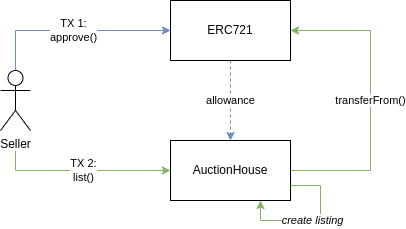
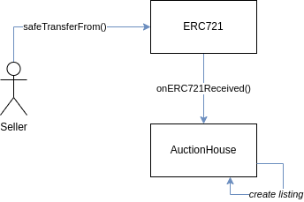

# NFT 接收钩子

- [📜 示例代码](./NftReceiveHooksAuction.sol)
- [🐞 测试](../../test/NftReceiveHooksAuction.t.sol)

ERC721（和 ERC1155）是定义 EVM 链上最常见 NFT 合约的代币标准，从 ERC20 中汲取了大量灵感。这一点在其限额机制中显而易见。用户调用 `approve()` 或 `setApprovalForAll()`，授予另一个地址在未来的交易/调用中转移自己的 NFT 代币的能力。如果执行 NFT 转移的交互是由另一个用户（而不是所有者）发送的，这就非常合理。但如果交易实际上是由代币所有者发送的，则根本没有必要使用限额机制！

## `onERC721Received()`
[ERC721 标准](https://eips.ethereum.org/EIPS/eip-721) 定义了一个 `onERC721Received()` 处理函数，可让接收方在调用 `safeTransferFrom()` 时控制执行。此外，一个任意的 `bytes` 数据参数也可以通过转账调用传递到处理程序中。该数据参数通常由处理程序解码，并提供有关转账目的的特定应用程序上下文。

## 案例学习：托管拍卖清单

为了展示该模式的优势，让我们看看它在虚构的托管 NFT 拍卖协议中采用传统的、基于限额的方法时是什么样子的。



1. 卖方进行交易 (1) 调用 `nft.approve(auctionHouse, tokenId)`，允许 `auctionHouse ` 代表其转让 `tokenId`。
2. 卖方进行另一笔交易 (2) 调用 `auctionHouse.list(nft, tokenId, listOptions)`。
    1. `auctionHouse` 调用 `nft.transferFrom(msg.sender, address(this), tokenId)` 来保管代币，并根据 `listOptions` 配置开始拍卖。

将此方法与使用接收钩子的简单方法进行比较。



1. 卖方进行一次交易，调用 `nft.safeTransferFrom(seller, auctionHouse, tokenId, abi.encode(listOptions))`。
    1. NFT 合约调用 `auctionHouse.onERC721Recevied(..., data)`。
        1. `auctionHouse` 解码 `data` (`listOptions = abi.decode(data, ListOptions)`) 并根据解码后的配置开始拍卖。

因此，在这种情况下，使用转账钩子对用户来说少了一次交易 😎。

## 钩子剖析
`onERC721Received()` 被声明为：

```solidity
function onERC721Received(address operator, address from, uint256 tokenId, bytes data) external returns(bytes4);
```

- 该函数在代币接收者身上调用。
- 调用是在代币转账后进行的。
- `operator` 是调用 `safeTransferFrom()` 的地址，在该模式中始终是 `tx.origin`（即所有者）。
- `from` 表示原有代币的所有者，在该模式中也是 `tx.origin`。
- `msg.sender` 将会是 ERC721 代币合约。
    - 任何人都可以调用此函数，因此根据产品的期望，你可能需要强制要求 `msg.sender` 是已知的 NFT 合约。

- `data` 是 `safeTransferFrom()` 调用者传入的任意数据。因此，不要指望它总是格式良好。
- 该处理函数不是 `payable` 的，因此如果你想在同一笔交易中向用户收取 ETH（不太可能），你可能需要让用户提前设置 WETH 额度。
- 该函数的返回值必须是 `onERC721Received.selector` (`0x150b7a02`)。

## ERC1155
[ERC1155 代币](https://eips.ethereum.org/EIPS/eip-1155#erc-1155-token-receiver)也通过其 `onERC1155Received()` 和 `onERC1155BatchReceived()` 钩子支持类似的机制，其语义几乎完全相同。

## 真实使用情况
- 官方 Mooncats 使用 `onERC721Received()` 将非官方封装的 mooncats 转换为官方封装的 mooncats，当有人将它们转入合约时。
- [0x 交换协议](https://github.com/0xProject/protocol/blob/development/contracts/zero-ex/contracts/src/features/nft_orders/ERC721OrdersFeature.sol#L462)的 ERC721 订单功能接受以"数据"参数编码的补充 NFT 买入订单，以便在转账的同时执行交换。

## 演示
[附带的演示](./NftReceiveHooksAuction.sol)是一个基本、简洁的 NFT 拍卖合约，它使用 `onERC721Received()` 在单笔交易中启动拍卖。