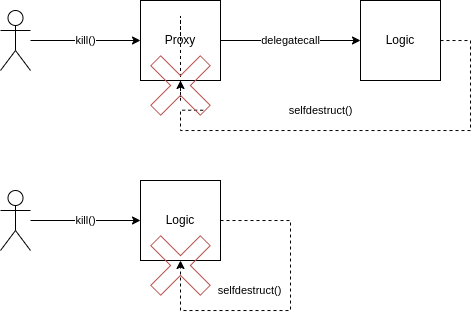

# 仅允许委托调用 / 不允许委托调用

- [📜 示例代码](./DelegateCallModifiers.sol)
- [🐞 测试](../../test/DelegateCallModifiers.t.sol)

在[代理合约](../basic-proxies/)的架构中，一个简约化的代理合约利用它的fallback函数将所有对其调用命令转至另一个逻辑合约去执行。这个方法使用了低阶函数 `delegatecall()` 来令逻辑合约的代码在此代理合约的背景下执行。这意味着一些全局变量比如 `msg.sender`，`msg.value`，和 `address(this)`，还有所有的储存空间，都指的是代理合约的（发起 `delegatecall()` 的那个合约）。这就允许代理合约去跑其他合约的字节码，仿佛是它自己的一样。


```
           call     ┌────────────────────┐              ┌────────────────────┐
       Proxy.foo()  │                    │              │                    │
User ───────────────►   Proxy Contract   │              │   Logic Contract   │
                    │                    │              │                    │
 ▲                  ├────────────────────┤ delegatecall └────────────────────┤
 │                  │                    ├──────────────►                    │
 │    foo() result  │     fallback()     │              │       foo()        │
 └──────────────────┤                    ◄──────────────┤                    │
                    ├────────────────────┐              └─────────┬──────────┘
                    │                    │                        │
                    │   storage/state    │                        │
                    │                    ├─ ── ── ── ── ── ── ── ─┘
                    └────────────────────┘       (shared state)
```

## 逻辑合约也是独立的合约
在代理执行的架构中，用户应该直接与代理合约交互而不去直接接触逻辑合约。然而，逻辑合约本身也经常是完整有效带有各种可独立执行的函数的这样一种合约。所以容易被遗忘的一件事就是，通常情况下。逻辑合约无法阻止某用户直接对其发起交互。大多数时候这不算什么大事情，因为逻辑合约本身并不存在于你的产品体系之内。然而也存在某些情况下你会想要某个逻辑合约的函数不允许被直接调用，抑或是仅允许被直接调用而不允许委托调用。幸好，有一种既低价又简单的方式去做这两件事。

## `onlyDelegateCall` 仅允许委托调用
2017年[Parity多签钱包被黑](https://blog.openzeppelin.com/parity-wallet-hack-reloaded/)导致了约1.5亿美元价值的ETH被永久锁死在一众现已完全无用的智能钱包之中。每一个钱包个体都要做类似于代理执行的行为，将一些函数调用命令委托至一个被共享的库作为其逻辑合约来执行这些操作。这个逻辑合约含有一个初始化的函数，本意是来用作一个当某个钱包在建立的过程中可被其委托调用的函数，此函数可以初始化一些属于这个新钱包个体的状态变量值，并将其标记为已初始化所以不可再调用初始化。然而，开发人员没有考虑到有人会去*直接*在逻辑合约本身上调用这个函数。第一个做这件事的人可以令其自己成为这个逻辑合约的主人。这个动作本身，对于那些钱包个体来说，没什么大不了的，可惜的是，这个逻辑合约自己另带有一个 `kill()` 函数，若是被合约主人执行了这个函数则此逻辑合约将自毁。

一旦自毁， `address(this)` 合约的可执行字节码就会被抹去。如果 `kill()` 是由一个钱包个体通过委托调用来发起的，则这个钱包将被毁。但是如果此函数是直接在逻辑合约本体上发起调用的，那么它毁掉的就是逻辑合约。若是逻辑合约的可执行字节码已不存在，那么任何来自于钱包指向此逻辑合约地址的 `delegatecall()` 都将什么事都做不成。比如说，取钱功能就废了。



从这汲取的教训就是如果你的逻辑合约可以自毁，或者你的逻辑合约可以发起委托调用至其他什么有自毁功能的合约，你就应该认真地考虑给合约加以限制令他只允许从别处而来的委托调用。现在的solidity可以很轻易地设计一个修饰函数比如 `onlyDelegateCall`，来实现这种限制。Parity那时候就没这个福气。

```solidity
abstract contract DelegateCallModifiers {
    // 本合约的地址。本合约的可执行字节码存在于此。
    address immutable public DEPLOYED_ADDRESS;

    constructor() {
        // 把本合约部署的地址存为不可改变量，则其值在各种delegatecall中都是一个不变值
        DEPLOYED_ADDRESS = address(this);
    }

    // 目前正在执行的合约环境的地址不可以与此逻辑合约的部署地址一致。
    modifier onlyDelegateCall() {
        require(address(this) != DEPLOYED_ADDRESS, 'must be a delegatecall');
        _;
    }
}
```

这个例子是一个模版合约你可以让你的逻辑合约去继承它，就可以使用那个修饰函数来限制你的任何其他带有风险的函数了。它是有效的，原因如下：
- 因为不可能对一个构造函数去委托调用，所以构造函数内部的 `address(this)` 永远将是此合约本体将会被部署在的地址。
- 不可更改的变量类型不使用合约的常规储存空间来存放其值，而是将值存放在部署的合约字节码之内，所以这个值在一个委托调用的语境之下依然是可以被获取的。
- 因为 `address(this)` 是来自于发起 `delegatecall()` 的那个合约，而那个不可变的 `DEPLOYED_ADDRESS` 是从被执行的字节码中读取而来，所以这两者就是不同的。

## `noDelegateCall` 不允许委托调用
有些合约尝试去利用具有限制性的许可证来避免他们的代码被分叉。但是有人就会狡猾地利用 `delegatecall()` 来规避这些许可的限制，这样他们可以用另一个产品做外表伪装而实际内核运行的还是别人已经部署好了的合约。Uniswap的初版和第二版都被分叉了无数次多到都有了梗图来取笑了，但是为什么第三版就没有这样呢？Uniswap V3 [更近一步看](https://github.com/Uniswap/v3-core/pull/327#issuecomment-813462722)它直接在其很多核心合约中禁止了被委托调用。

创建一个 `noDelegateCall` 修饰函数（ `onlyDelegateCall` 的反向作用）我们仅需把不等号调换成等号即可。现在我们*想要*执行背景的地址与本合约的部署地址一致。如果其他任何合约发过来委托调用，这两者都不会相一致。小菜一碟！

```solidity
// 执行的背景的地址与本合约的部署地址必须一致
modifier noDelegateCall() {
    require(address(this) == DEPLOYED_ADDRESS, 'must not be delegatecall');
    _;
}
```

## 示例代码
[这个例子](./DelegateCallModifiers.sol)在一个代理合约的架构中使用了这两种修饰函数。我们有两个版本的逻辑合约， `Logic` 和 `SafeLogic`，可用来展示这两个修饰各自的用武之处。 `Logic` 有两个函数，各自都有漏洞：

- `die()`，它的本意是想，当被初始化时指定的主人发起委托调用的时候，让*代理合约*执行自毁。然而，就像Parity被黑的那次例子一样， `Logic` 合约可以被其他人在本体上直接初始化，指定主人，然后直接调用 `die()`，这样就破坏掉所有依赖于这个逻辑合约地址的其他代理合约。
- `skim()` 是一个很方便的函数，可以允许任何人取走之前被错误发送至此合约地址中的ETH。但是，这个函数可以被委托调用，意思是其他任何合约都可以利用这个逻辑执行来让自己的ETH在任何时候被取走。

`SafeLogic` 合约重做并修复了这些在 `Logic` 里有漏洞的函数，它在 `die()` 函数上加以 `onlyDelegateCall` 限制，在 `skim()` 上加以 `noDelegateCall` 限制。在[测试](../../test/DelegateCallModifiers.t.sol)里面有如何去攻击那些有漏洞的函数的例子。