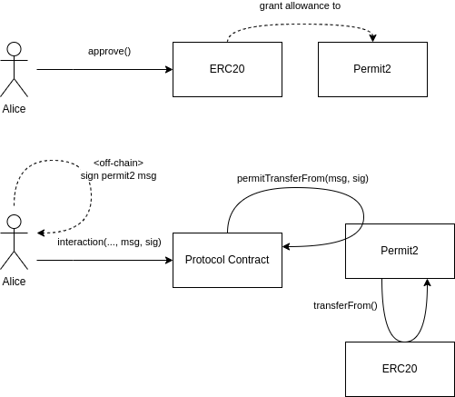

# Permit2
- [📜 示例代码](./Permit2Vault.sol)
- [🐞 测试](../../test/Permit2Vault.t.sol)

当一个协议需要将token从持有的用户手中转移时，第一步通常是让用户为其合约的ERC20代币设置限额，这是[ERC20](https://eips.ethereum.org/EIPS/eip-20)标准规定的方法，尽管存在UX和安全缺陷，但很少受到挑战。[EIP-2612](https://eips.ethereum.org/EIPS/eip-2612)是对ERC20标准的改进，可以解决这些缺陷但是只能应用于新的token。[Permit2](https://github.com/Uniswap/permit2)利用这两种模型来扩展 EIP-2612 的用户体验和安全优势，并且可以涵盖原版 ERC20 代币

为了说明 Permit2 革命性变革，让我们快速回顾之前的通用场景的解决方案：协议需要移动Alice持有的代币。

## 标准授权模型

首先，传统的基于限额的方案，通常是这样的：

1. Alice首先调用ERC20合约的`approve()`方法以向合约授权可使用额度
2. Alice与合约进行交互，合约继而调用ERC20合约的`transferFrom()`方法，将她的token进行转移

显而易见，这种模式是可行的（它无处不在），并且非常灵活因为协议可以不中断，长期的操作用户授权的token，但是它有两个众所周知的现实问题：

- **糟糕的用户体验**: 用户必须对每个需要交互的新协议进行approve，并且大多数都是单独的交易 💸
- **安全性差**: 应用通常会向用户要求无上限的token授权额度，以避免重复上述用户体验问题。这意味着，如果协议被攻击，所有授权过token给协议的用户，他们的代币都有可能被从钱包中转出 🙈

## Permit (EIP-2612) 模型
接下来，让我们看下ERC20d的拓展EIP-2612的启用方法，通常如下所示：


1. Alice 签署了一条链下“许可”消息，表示她希望授予合约使用（EIP-2612）代币。
2. Alice 提交签名的消息，作为她与合约交互的一部分信息。
3. 合约对token调用 `permit()` 方法，接收许可消息和签名，授予token额度给合约。
4. 合约现在有token使用权限，所以它可以调用 `transferFrom()` 代币，移动Alice持有的代币。

这解决了传统ERC20方法的两个问题：
- 用户不需要提交独立的`approve()` 交易
- 悬而未决的授权额度不再是必须的风险，因为许可消息授予的即时额度通常会立即花费。许可消息还可以选择更合理的限额金额，更重要的是，可以选择可以使用许可消息的到期时间。

但悲惨的现实是，大多数时候这种方法并不是一种选择。由于 EIP-2612 是 ERC20 标准的扩展，因此此功能仅在新的（或可升级的）token上可用。因此这种模式实际起作用的主要代币很少。

*(旁注：EIP-2612 许可已在此处的单独指南中进行了更详细的[探讨](../erc20-permit)!)*

## Permit2 模型

最后，让我们深入了解 Permit2 方法，该方法与上述两个解决方案中的元素相呼应：



1. Alice对ERC20调用 `approve()` 方法为规范的Permit2合约授予无限的额度。
2. Alice 签署了一条链下“permit2”消息，该消息表示允许协议合约代表她*转移*代币。
3. Alice 在协议协定上调用交互函数，将签名的 permit2 消息作为参数传递。
4. 协议合约调用 `permitTransferFrom()` Permit2 合约，而 Permit2 合约又使用其授权的额度（在 1 中授予）调用 `transferFrom()` ERC20 合约，移动 Alice 持有的代币。

这似乎又回到了要求用户首先显式授予。但是，用户不会直接将其授予协议，而是将其授予规范的 Permit2 合约。这意味着，如果用户之前已经这样做过，比如与集成 Permit2 的另一个协议进行交互，则所有其他协议都可以跳过该步骤！🎉

协议将调用 `permitTransferFrom()` 规范的 Permit2 合约，而不是直接调用 `transferFrom()` ERC20 代币来执行转移。Permit2 位于协议和 ERC20 令牌之间，跟踪和验证 permit2 消息，然后最终使用其允许直接在 ERC20 上执行 `transferFrom()` 调用。这种间接性允许 Permit2 将类似 EIP-2612 的模式扩展到每个现有的 ERC20 代币！ 🎉

此外，与 EIP-2612 许可消息一样，permit2 消息存在过期时间，以限制漏洞利用的攻击窗口。

## 集成 Permit2

对于集成 Permit2 的前端，它需要收集将传递到交易中的用户签名。这些签名的 Permit2 消息结构 （ `PermitTransferFrom` ） 必须符合 [EIP-712](https://eips.ethereum.org/EIPS/eip-712) 标准（前面有介绍过的[指南](../eip712-signed-messages/)），使用此处和此处定义的 Permit2 域和类型哈希[EIP-712](https://github.com/Uniswap/permit2/blob/main/src/EIP712.sol)。请注意，EIP-712 Permit2 对象的 `spender` 字段需要设置为将使用它的合约地址。

智能合约的集成实际上相当容易！任何需要移动用户持有的token的功能只需要接受任何未知的许可消息详细信息和相应的 EIP-712 用户签名。为了实际移动token，我们将调用 `permitTransferFrom()` 规范的 Permit2 合约。该函数声明为：


```solidity
    function permitTransferFrom(
        PermitTransferFrom calldata permit,
        SignatureTransferDetails calldata transferDetails,
        address owner,
        bytes calldata signature
    ) external;
```

此函数的参数为：
- `permit` - permit2消息详细信息，包括以下字段：
    - `permitted` -  `TokenPermissions` 具有以下字段的结构:
        - `token` - 要转移的token的地址
        - `amount` - 此许可能转移的*最大*金额
    - `nonce` - 由我们的应用程序选择的唯一编号，用于标识此许可消息。一旦使用过该许可消息，使用该随机数的任何其他许可消息都将无效
    - `deadline` - 此许可消息有效的区块时间戳
- `transferDetails` - 包含转账接收方和转账金额的结构，可以小于用户签名的授权额度
-  `owner` - 谁签署了许可并持有token。通常，在调用方和用户相同的简单用例中，应将其设置为调用方 （ `msg.sender` ）。但在更复杂的集成中，您可能需要更复杂的[检查](https://docs.uniswap.org/contracts/permit2/reference/signature-transfer#security-considerations)
- `signature` - permit2消息的相应 EIP-712 签名，由owner签名。如果从签名验证中恢复的地址与owner不匹配，则调用将失败。

> 请注意，该 `PermitTransferFrom` 结构不包括在许可消息的 EIP-712 类型哈希定义中找到的 `spender` 字段[EIP-721中的typehash字段定义](https://github.com/Uniswap/permit2/blob/main/src/libraries/PermitHash.sol#L21)。在处理过程中，它将被合约地址填充（直接 `permitTransferFrom()` 调用方）。这就是为什么用户签名的 EIP-712 对象的 `spender` 字段必须是此合约的地址。

### 高级集成
这个指南涵盖了Permit2提供的一些基础的功能，下面这些提供了Permit2的更多使用
- [自定义见证数据](https://docs.uniswap.org/contracts/permit2/reference/signature-transfer#single-permitwitnesstransferfrom) - 您可以将自定义数据附加到 Permit2 消息中，这意味着 Permit2 签名验证也将扩展到该数据。
- [批量交易](https://docs.uniswap.org/contracts/permit2/reference/signature-transfer#batched-permittransferfrom) - 用于执行多次传输的批量Permit2消息，由单个签名保护
- [智能Nonces](https://docs.uniswap.org/contracts/permit2/reference/signature-transfer#nonce-schema) - Nonce实际上以位字段的形式写入由高 248 位索引的存储槽中。通过仔细选择重复使用存储槽的随机数值，您可以节省大量的 Gas。
- [回调签名](https://github.com/Uniswap/permit2/blob/main/src/libraries/SignatureVerification.sol#L43) - Permit2 支持 [EIP-1271](https://eips.ethereum.org/EIPS/eip-1271) 回调签名，这允许智能合约也签署 Permit2 消息。
- [Permit2 配额](https://docs.uniswap.org/contracts/permit2/reference/allowance-transfer) - 对于需要更大灵活性的协议，Permit2 支持更传统的配额模型，该模型可以获得过期时间的额外好处

## 示例

提供的[示例代码](./Permit2Vault.sol)是一个简单的金库，用户可以使用 Permit2 将 ERC20 代币存入其中，然后可以提取。由于它是多用户的，因此需要启动转账才能可靠地记入哪个帐户拥有哪个余额。通常，这需要向金库合约授予津贴，然后让金库对代币本身执行 `transferFrom()` ，但 Permit2 允许我们跳过这个麻烦！
这些[测试](../../test/Permit2Vault.t.sol)部署了主网 Permit2 合约的本地字节码分支来测试 Vault 的实例。 EIP-712 哈希和签名生成也是用 Solidity Foundry 编写的，但通常应该在前端/后端以您选择的语言进行链下执行。
## 资源
- [Permit2 公告](https://uniswap.org/blog/permit2-and-universal-router) - 标准的 Permit2 地址也可以在此处找到。
- [Permit2 仓库](https://github.com/Uniswap/permit2) - Permit2 智能合约
- [Permit2 `SignatureTransfer` 文档](https://docs.uniswap.org/contracts/permit2/reference/signature-transfer) - Uniswap 提供的官方 Permit2 文档
