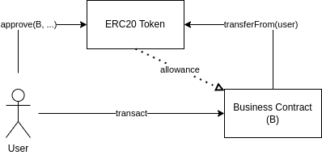
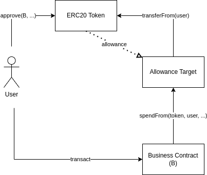

# 将授权转账权限的合约单独抽象出来

- [📜 示例代码](./AllowanceTarget.sol)
- [🐞 测试](../../test/AllowanceTarget.t.sol)


通常，需要花费用户的 ERC20 代币的协议会要求用户在他们的主要业务逻辑合约上设置一个授权（通过 `ERC20.approve()`），然后就可以直接调用 ERC20 合约上的 `transferFrom()` 来从用户那里拉取代币。




然而，如果逻辑合约的新版本被部署，现有的用户将不得不在这个合约上设置所有新的授权，并可能需要撤销在旧合约上设置的授权。如果你正在以常规的速度迭代你的合约，这可能会导致大量用户体验上的不适。


与其让用户在你的业务合约上进行转账授权，不如部署一个单一目的的“转账”合约，用户可以向该合约进行转账授权。该合约可以代表授权调用者执行 `transferFrom()` 的函数，而对该合约的调用者则是你的业务合约。




该转账合约在业务协议升级过程中无需进行任何改变，随着协议的演变，可以给新版本的业务合约添加权限，因此协议合约的新版本可以立即使用现有的代币许可。也可以删除授权的调用者，这是安全地停用和解除协议的过时组件的便捷方式。

## 设计 `授权转账` 合约


`授权转账` 合约只需要做如下几件事情:
- 暴露一个 `spendFrom()` 函数，该函数反过来被业务合约调用, 通过`transferFrom()`替业务合约从用户侧转账给定数量的代币。
- 维护允许调用 `spendFrom()` 的业务合约地址。
- 允许管理员添加新的业务地址。

所以首先我们需要定义两个状态变量 -- 一个于跟踪管理员，另一个用于跟踪是否允许某个具体的地址调用 `spendFrom()`：

```solidity
address public admin;
mapping (address => bool) public authorized;
```

我们在构造函数中初始化管理员。我们还需要定义一个函数，让管理员授权（和取消授权）可以发起 `spendFrom()` 调用的地址。


```solidity
constructor(address admin_) {
    admin = admin_;
}

function setAuthority(address authority, bool enabled) external {
    require(msg.sender == admin, 'only admin can call this');
    authorized[authority] = enabled;
}
```

最后，我们暴露 `spendFrom()` 函数，该函数应被授权方（业务合约）的要求执行 `transferFrom()`。


```solidity
function spendFrom(IERC20 token, address from, address to, uint256 value)
    external
{
    require(authorized[msg.sender], 'only authorized');
    token.transferFrom(from, to, value);
}
```

💡 *注意，在以太坊主网上，由于部分 ERC20 的实现并不符合标准规范, 你可能会希望以一种[兼容所有 ERC20 代币实现的方式](../erc20-compatibility/)调用 `transferFrom()`。*


## 示例

所包含的[示例](./AllowanceTarget.sol)有一个完全可用的 `授权转账` 合约，该合约还支持不符合标准规范实现的 ERC20 代币。此外[测试](../../test/AllowanceTarget.sol)从用户和业务合约的角度展示了该合约的用法。


## 实际使用
- 这种模式的早期的实际应用场景之一是与 0x v1（直至 v3）的交易所协议，该协议具有独立的["资产代理"](https://etherscan.io/address/0xf740b67da229f2f10bcbd38a7979992fcc71b8eb#code#F17#L1)合约，它们是代币转账授权的目标，并在结算期间代表协议执行转账。这些资产代理在协议的后续多个版本中持续使用。
- Opensea 的 Seaport 协议有一个["导管"](https://github.com/ProjectOpenSea/seaport/blob/main/contracts/conduit/Conduit.sol)的概念，本质也是独立于撮合合约的独立合约，用户向其授权转账权限，撮合协议在结算期间通过它们执行转账。
